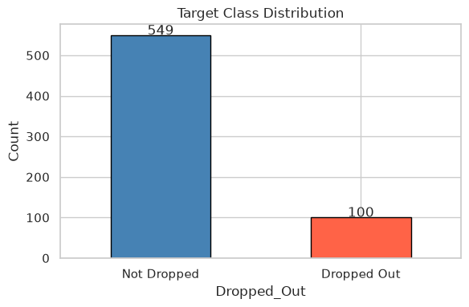
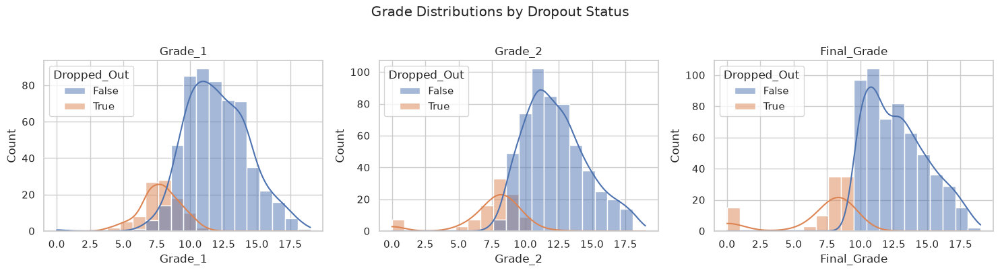
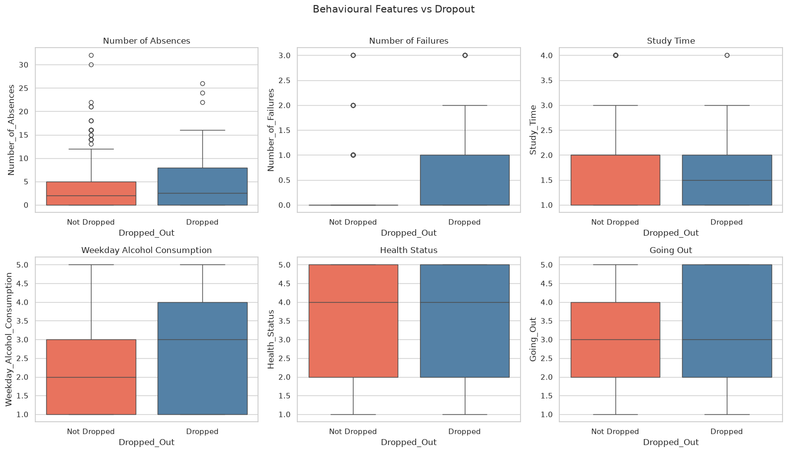
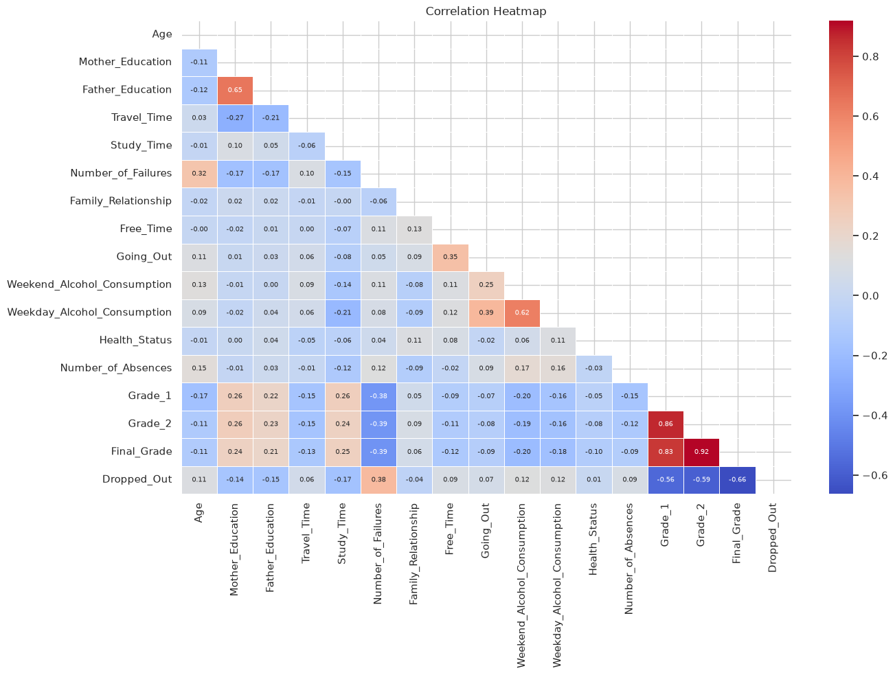
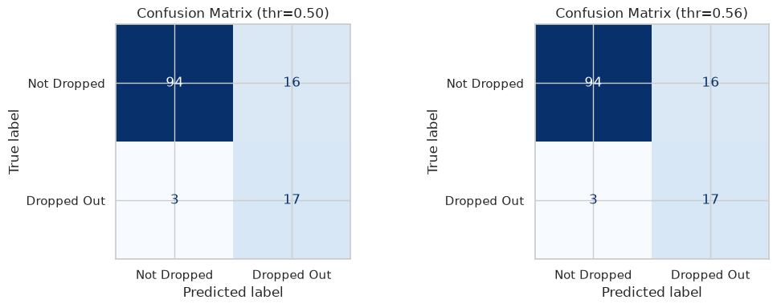
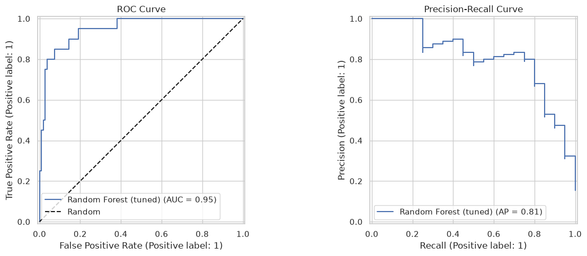
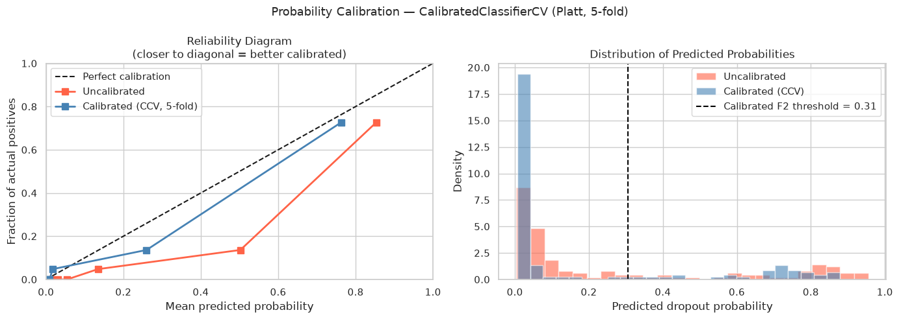
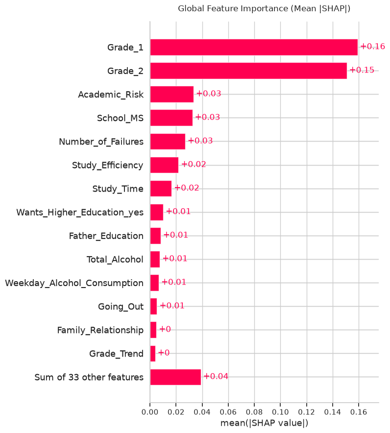
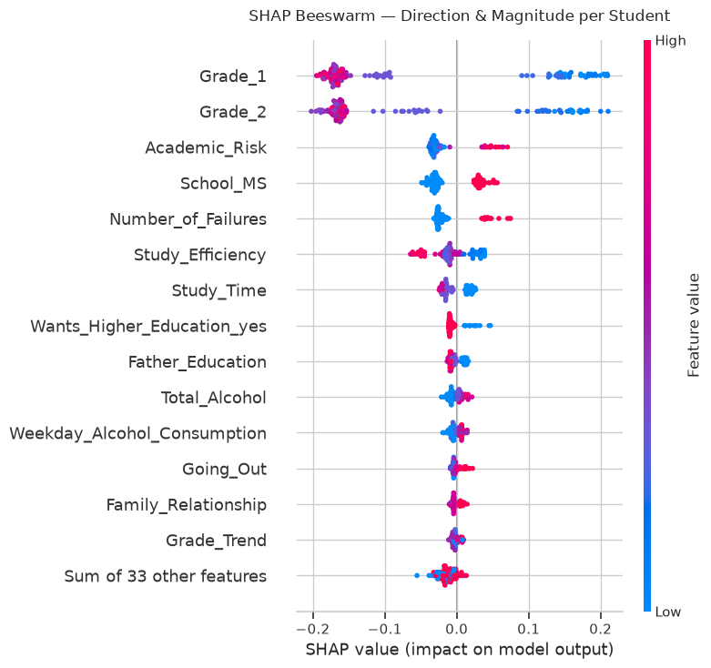

# 🎓 Early Student Dropout Risk Classification

A machine learning system that identifies students at risk of dropping out **before it happens** — giving counselors and teachers time to intervene. Built on Portuguese secondary school data, with a full pipeline from raw data to an interactive risk-assessment web app.

> 📄 For the complete methodology, design decisions, and rationale behind every modeling choice, see [dropout.md](dropout.md).

---

## Table of Contents

- [Problem Statement](#problem-statement)
- [Dataset](#dataset)
- [Exploratory Data Analysis](#exploratory-data-analysis)
- [Methodology](#methodology)
- [Model Performance](#model-performance)
- [Explainability](#explainability)
- [Project Structure](#project-structure)
- [Installation](#installation)
- [Usage](#usage)
- [Docker Deployment](#docker-deployment)
- [Limitations](#limitations)

---

## Problem Statement

Schools need to flag at-risk students **proactively**, not after they've already dropped out. This project builds an early-warning classifier that:

- Predicts dropout **probability** for each student using only information available *before* dropout occurs
- Handles severe **class imbalance** (~15% dropout rate)
- Optimizes for **recall** — missing an at-risk student is far costlier than a false alarm
- Explains **why** a student is flagged, so staff can act on it, not just a score

---

## Dataset

| | |
|---|---|
| **Source** | Portuguese secondary school student performance records |
| **Size** | 649 students, 34 original columns |
| **Target** | `Dropped_Out` (boolean), ~15% positive rate |
| **Features** | Demographics, family background, behavioral patterns, academic performance |

### Class Imbalance



Only ~15% of students in the dataset dropped out — a naive "predict no dropout for everyone" model would score 85% accuracy while being completely useless. This is why the project evaluates with **F2-score** instead of accuracy (see [Methodology](#methodology)).

---

## Exploratory Data Analysis

### Grade Distributions by Outcome



Students who dropped out show a visibly different grade distribution across `Grade_1`, `Grade_2`, and `Final_Grade` compared to those who stayed enrolled.

> ⚠️ **Data leakage caught here:** `Final_Grade = 0` for 100% of students who dropped out — because the grade is recorded as zero *as a consequence* of dropping out, not a predictor of it. `Final_Grade` was removed from the feature set. Full investigation in [dropout.md § 2](dropout.md#2-data-leakage-investigation).

### Behavioral & Academic Risk Factors



Absences, prior failures, study time, alcohol consumption, health status, and social activity — each compared across dropout vs. non-dropout groups.

### Feature Correlation



Correlation matrix across all numeric features, used to guide feature engineering decisions (e.g., dropping `Grade_Avg` as a redundant linear combination of `Grade_1` and `Grade_2`).

---

## Methodology

Full detail for every step lives in [dropout.md](dropout.md). Summary:

1. **Leakage removal** — `Final_Grade` dropped; `Grade_1`/`Grade_2` retained (available pre-dropout)
2. **Feature engineering** — 7 derived features: `Grade_Trend`, `Low_Grade_Flag`, `Total_Alcohol`, `Max_Parent_Edu`, `Academic_Risk`, `Study_Efficiency`, `Grade_Avg` (internal only)
3. **Stratified 80/20 train/test split** — preserves the ~15% dropout ratio in both sets
4. **Preprocessing** — One-Hot Encoding (categorical) + StandardScaler (numeric), embedded inside the pipeline to prevent leakage across CV folds
5. **Imbalance handling** — SMOTENC (handles mixed categorical/numeric data correctly, applied *before* encoding)
6. **Model selection** — Logistic Regression, Random Forest, and XGBoost compared via 5-fold stratified CV on F2-score
7. **Hyperparameter tuning** — Optuna (Bayesian/TPE), 60 trials each for XGBoost and Random Forest
8. **Threshold selection** — F2-optimal threshold chosen on a held-out validation set (not the test set)
9. **Stacking ensemble** — XGBoost + Random Forest + ExtraTrees base learners, Logistic Regression meta-learner
10. **Probability calibration** — Platt scaling (sigmoid) to correct tree-model overconfidence
11. **Fairness audit** — recall checked across gender, school, address, and age subgroups
12. **Explainability** — SHAP (global + per-student) and LIME (local cross-check)

### Why F2-Score?

```
F2 = (1 + 4) × Precision × Recall / (4 × Precision + Recall)
```

F2 weights recall **twice** as heavily as precision. In this domain, missing a student who will drop out (false negative) is far more costly than flagging a student who won't (false positive) — the latter just means unneeded extra support.

---

## Model Performance

### Confusion Matrix & Threshold Tuning



Comparison of the default 0.50 threshold vs. the F2-optimal threshold selected on the validation set — the tuned threshold catches more true dropouts at an acceptable cost in false positives.

### ROC Curve



### Probability Calibration



Tree-based models tend to be overconfident (pushing probabilities toward 0 or 1). Platt scaling recalibrates the output so that "70% dropout risk" actually corresponds to a ~70% real-world rate — critical for counselors making decisions from these scores.

| Design Decision | Choice Made | Rejected Alternative | Reason |
|---|---|---|---|
| Imbalance handling | SMOTENC before encoding | BorderlineSMOTE after encoding | Avoids meaningless fractional values in one-hot columns |
| Evaluation metric | F2-score | F1 / Accuracy | Recall matters twice as much as precision here |
| Hyperparameter search | Optuna (TPE) | GridSearch / RandomizedSearch | Learns from prior trials instead of searching blindly |
| Threshold selection | F2-optimal, validation set | F1-optimal, test set | F1 pushed threshold to 0.97, increasing missed dropouts |
| Calibration | Platt scaling | None | Corrects tree-model overconfidence in risk scores |

---

## Explainability

### Global Feature Importance (SHAP)



### SHAP Beeswarm — Direction & Magnitude per Student



Each point is one student; color shows feature value, position shows its impact on the dropout prediction. This reveals not just *which* features matter, but *how* — e.g., high `Academic_Risk` consistently pushes predictions toward dropout.

Every high-risk prediction is paired with:
- A **SHAP waterfall** showing exactly how each feature contributed to that student's score
- A **LIME explanation** as an independent, model-agnostic cross-check
- A rule-based table of **concrete intervention recommendations** (e.g., "Grade_1 ≤ 8 → assign peer tutor immediately")

See [dropout.md § 15–17](dropout.md#15-explainability--shap) for full detail.

---

## Project Structure

```
.
├── app.py                    # Streamlit web app (single & batch risk assessment)
├── EDA.ipynb                 # Full exploratory analysis + modeling notebook
├── dropout.md                 # Complete technical documentation & rationale
├── student dropout.csv        # Raw dataset
├── model_artifacts/           # Trained pipeline, calibrated model, metadata (generated)
├── assets/                    # README images
├── requirements.txt
├── Dockerfile
├── .dockerignore
└── DEPLOYMENT.md              # Deployment instructions
```

---

## Installation

```bash
git clone git@github.com:Karanpl-1945/Early-Dropout-Risk-Classification.git
cd Early-Dropout-Risk-Classification

python3 -m venv dropout_env
source dropout_env/bin/activate      # Windows: dropout_env\Scripts\activate

pip install -r requirements.txt
```

**Requirements:** Python 3.10+, streamlit, pandas, numpy, scikit-learn, imbalanced-learn, shap, matplotlib, joblib, xgboost.

---

## Usage

### Run the notebook

Open `EDA.ipynb` to reproduce the full analysis, model training, and artifact generation (outputs to `model_artifacts/`).

### Run the web app

```bash
streamlit run app.py
```

The app provides:
- **Single Student Risk Assessment** — enter one student's details, get a risk tier (LOW / MEDIUM / HIGH) with SHAP-driven explanations
- **Batch Risk Assessment** — upload a CSV of multiple students for bulk scoring
- **Model Information** — view model metrics, calibration, and metadata

---

## Docker Deployment

```bash
docker build -t dropout-risk-app .
docker run -p 8501:8501 dropout-risk-app
```

See [DEPLOYMENT.md](DEPLOYMENT.md) for full deployment instructions.

---

## Limitations

- **Small dataset** (649 students) — performance estimates have wide confidence intervals
- **Single school system** — patterns may not transfer to other countries/education systems without revalidation
- **Fairness gaps** — lower recall observed for urban students and younger students (15–17); group-wise threshold tuning was considered but rejected due to insufficient subgroup data
- **Static model** — trained once; does not update risk scores as new data (attendance, mid-term grades) arrives during the year

Full discussion and future work in [dropout.md § 18](dropout.md#18-limitations-and-future-work).
